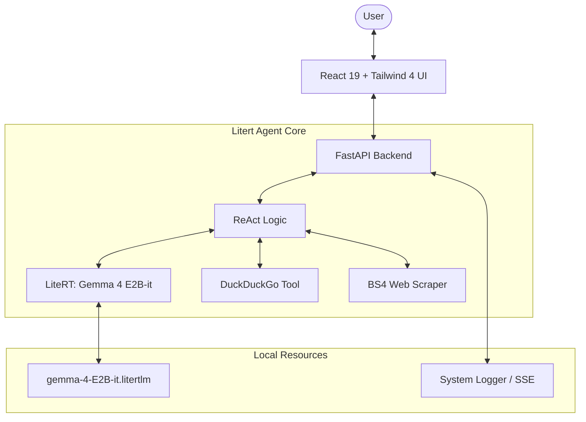

# 🌌 Litert: Local Autonomous Web-Intelligence

[](https://fastapi.tiangolo.com/)
[](https://react.dev/)
[](https://ai.google.dev/edge/litert)
[](https://tailwindcss.com/)
[](https://opensource.org/licenses/MIT)

**Litert** is an Local AI Agent designed to bring high-performance web-intelligence to any **standard office laptop or PC**. It empowers users with smart tools to search, visit, and synthesize real-time web data locally and privately. It is built on Google's **LiteRT** (formerly TFLite) for edge-optimized execution of the **Gemma 4 E2B-it** model.

---

## ✨ Core Features

### 🕵️‍♂️ Litert: The ReAct Intelligence
Litert isn't just a chatbot; it's a **ReAct (Reason + Act)** autonomous agent.
- **Autonomous Search**: Uses DuckDuckGo to find information in real-time.
- **Deep Exploration**: Proactively visits URLs, scrapes content with BeautifulSoup, and synthesizes it into grounded answers.
- **Massive Context**: Leveraging Gemma-4's native support for up to 128K tokens (managed by intelligent pruning for localized speed).
- **Hyper-Strict Citations**: Every fact is linked directly to its source using `[Title](URL)` format—no hallucinations, no placeholders.

### ⚡ Technical Excellence
- **Edge-Optimized Inference**: Uses `litert-lm` for extremely fast localized inference on CPU/XNNPack.
- **Multimodal DNA**: Powered by the Gemma 4 family, designed for high-efficiency multimodal understanding in a compact 2.3B parameter footprint.
- **Zero-Config Deployment**: A unified `run.sh` script that handles system dependencies (Node, Python, Pip, venv, apt/brew) automatically.
- **Modern React 19 Frontend**: 
  - **Tailwind CSS 4**: Utilizing the latest CSS-first design engine.
  - **Framer Motion**: Smooth, premium micro-animations and transitions.
  - **Persistent Workspace**: Multi-chat history stored in LocalStorage for cross-session continuity.
- **Real-Time Observability**: Stream system logs directly to the UI via Server-Sent Events (SSE).

---

## 🏗️ Architecture



---

## 🚀 Quick Start

### 1. Get the Code
Clone the repository or download the source as a ZIP file:

**Option A: Git Clone (Recommended)**
```bash
git clone https://github.com/christonomous/Litert.git
cd Litert
```

**Option B: Download ZIP**
Click here to [Download ZIP](https://github.com/christonomous/Litert/archive/refs/heads/main.zip)

### 2. The "One-Command" Setup
Litert is designed for zero friction. On Linux (Ubuntu) or macOS, simply run:

```bash
chmod +x run.sh
./run.sh
```

**What this script does:**
1.  **System Audit**: Checks for `python3`, `node`, `npm`, and `curl`.
2.  **Auto-Install**: Installs missing dependencies (via `apt` or `brew`).
3.  **Environment Setup**: Creates a Python Virtual Environment (`.venv`) and installs Node modules.
4.  **Zero-Orchestration**: Automatically launches the FastAPI backend and the Vite development server simultaneously.

### Manual Access
-   **Frontend**: [http://localhost:5173](http://localhost:5173)
-   **Backend API**: [http://127.0.0.1:8000](http://127.0.0.1:8000)
-   **Interactive Docs**: [http://127.0.0.1:8000/docs](http://127.0.0.1:8000/docs)

---

## 🛠️ Tech Stack

### Backend
- **Core**: Python 3.10+, FastAPI
- **LLM Engine**: `litert-lm` (Gemma 4 E2B-it)
- **Tools**: `duckduckgo-search`, `BeautifulSoup4`, `Requests`
- **Streaming**: Server-Sent Events (SSE) for Logs & Chat

### Frontend
- **Core**: React 19 (Vite)
- **Styling**: Tailwind CSS v4.0, Framer Motion
- **Icons**: Lucide React
- **Markdown**: `react-markdown` with `remark-gfm` (Github Flavored Markdown)

---

## ⚙️ Configuration

The agent's personality and rules are defined in `system_prompt.md`. You can customize how **Litert** behaves by editing this file—the backend will reload it on the next chat request.

```markdown
# Edit system_prompt.md to change:
- Agent Identity
- Citation Requirements
- Formatting Output
```

---

## 🤝 Contributing

1. Fork the Project
2. Create your Feature Branch (`git checkout -b feature/AmazingFeature`)
3. Commit your Changes (`git commit -m 'Add some AmazingFeature'`)
4. Push to the Branch (`git push origin feature/AmazingFeature`)
5. Open a Pull Request

---

<p align="center">
  🚀 <i>Building the future of Smart Sovereignty.</i><br/><br/>
  <a href="https://www.linkedin.com/in/christonomous/">
    
  </a><br/>
  <b>Follow to get insights on AI, Local LLMs, and Sovereign Systems.</b>
</p>
